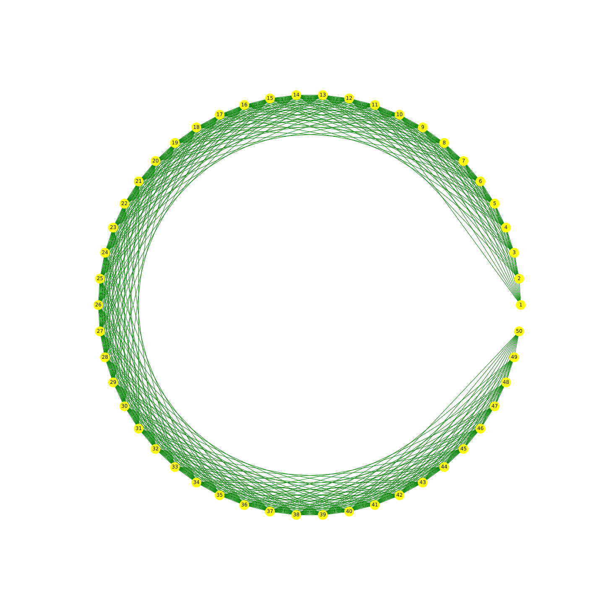

# Friendly Farmers
 Signed Networks in Social Networking
___

<h4>Signed Networks</h4>

<h5>Problem Scenario</h5>

Assume that in a sparsely populated area, 50 farmers live along a 50km stretch of a river,
each occupying exactly 1km of the river bank. After interviewing these farmers, you discover
that each farmer is friends with all farmers that live at most 10km away from him or her,
and enemies with every other farmer. Assuming you were to build the signed complete graph
of this network, would it be structurally balanced (w.r.t. strong structural balance theory)?
Explain your answer!

<h5>Solution</h5>

Consider, the triangles (5,3,17) and (1,26,49)

Here, (5,3,17) is balanced as it has 1 positive sign and (1,26,49) is unbalanced as it has 0 positive sign.

So, We can conclude that the network is not structurally balanced.

A graphical representation of friendship among 20 farmers. 